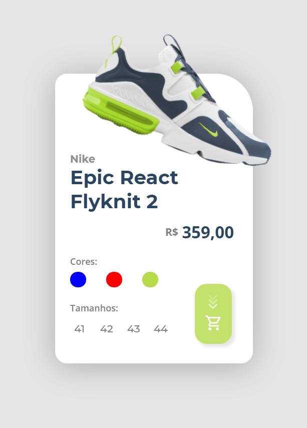

 
  

  &#xa0;

  <!-- <a href="https://desafiopapodedev.netlify.app">Demo</a> -->

<h1 align="center">Desafio Papodedev</h1>

  

  

  

  

  <!--  -->

  <!--  -->

  <!--  -->

<!-- Status -->

<!-- <h4 align="center"> 
	🚧  Desafio Papodedev 🚀 Under construction...  🚧
</h4> 

 -->

  <a href="#dart-about">About</a> &#xa0; | &#xa0; 
  <a href="#sparkles-features">Features</a> &#xa0; | &#xa0;
  <a href="#rocket-technologies">Technologies</a> &#xa0; | &#xa0;
  <a href="#white_check_mark-requirements">Requirements</a> &#xa0; | &#xa0;
  <a href="#checkered_flag-starting">Starting</a> &#xa0; | &#xa0;
  <a href="#memo-license">License</a> &#xa0; | &#xa0;
  <a href="https://github.com/nicolaswalcker" target="_blank">Author</a>

 

## :dart: About ##

This project was done during a challenge. This is a sales card that has some features.

## :sparkles: Features ##

:heavy_check_mark: Select a color;\

## :hammer: Adjustments and improvements
- [ ] Change the colors of the layout according to the selected color.
- [ ] Add more animations to the purchase button.
- [ ] Keep a button of selected size.
- [ ] Add a background.
- [ ] Make version with "glass" background.

## :rocket: Technologies ##

The following tools were used in this project:

- [HTML5]()
- [CSS3]()
- [JavaScript]()
  - [Tilt.js](https://gijsroge.github.io/tilt.js/)

## :memo: License ##

This project is under license from MIT. For more details, see the [LICENSE](LICENSE) file.

## 👨‍💻 Author 
<table>
  <tr>
    <td align="center">
      <a href="https://github.com/nicolaswalcker">
         
        
          <b>Nicolas Walcker</b>
        
      </a>
    </td>
  </tr>
</table>
&#xa0;

<a href="#top">Back to top</a>
