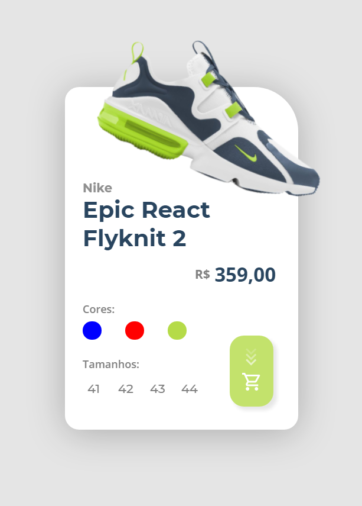

# Desafio Papo de Dev

> Um pequeno card de produto a ser vendido.

## Ajustes e melhorias
O projeto ainda está em desenvolvimento e as seguintes atualizações serão feitas.

- [ ] Trocar as cores do layout de acordo com a cor selecionada.
- [ ] Adicionar mais animações ao botão de compra.
- [ ] Manter um botão de tamanho selecionado.
- [ ] Adicionar um fundo.
- [ ] Fazer versão com fundo "glass".

## Tecnologias usadas

* HTML5
* CSS3
* Javascript
* Tilt.js

